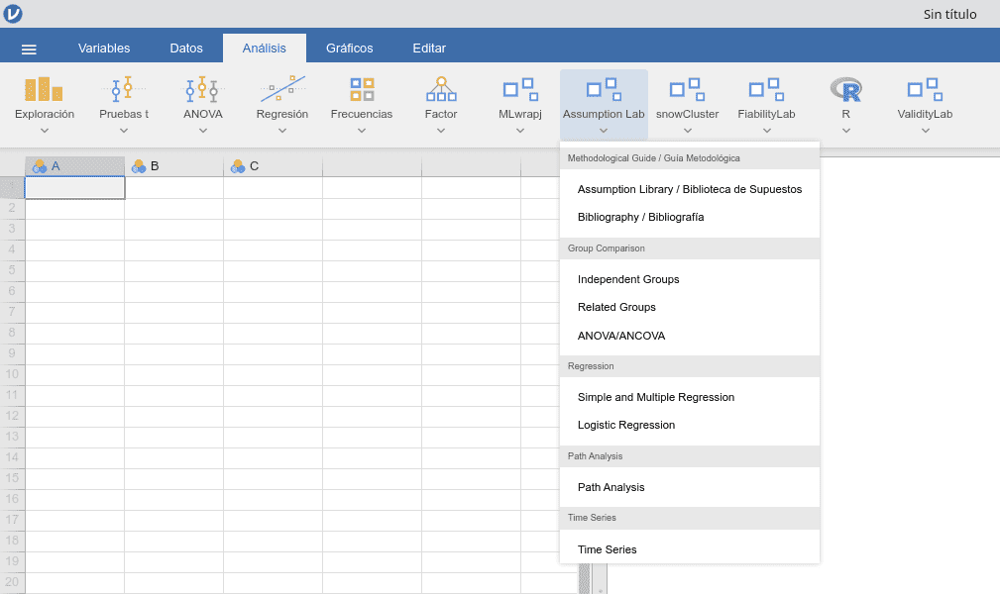
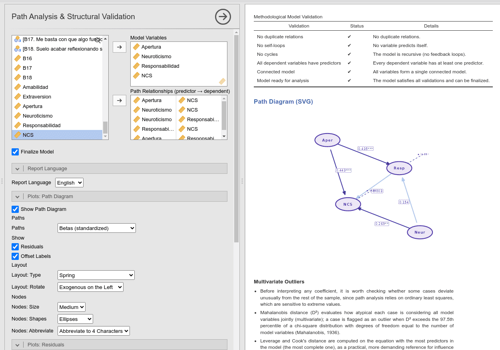
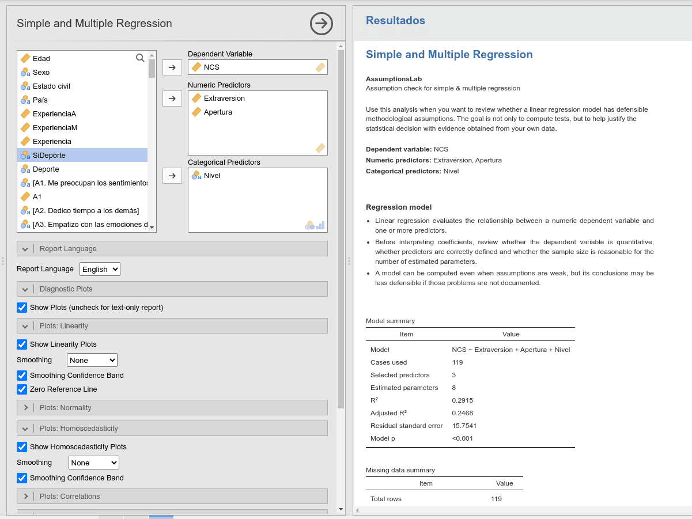
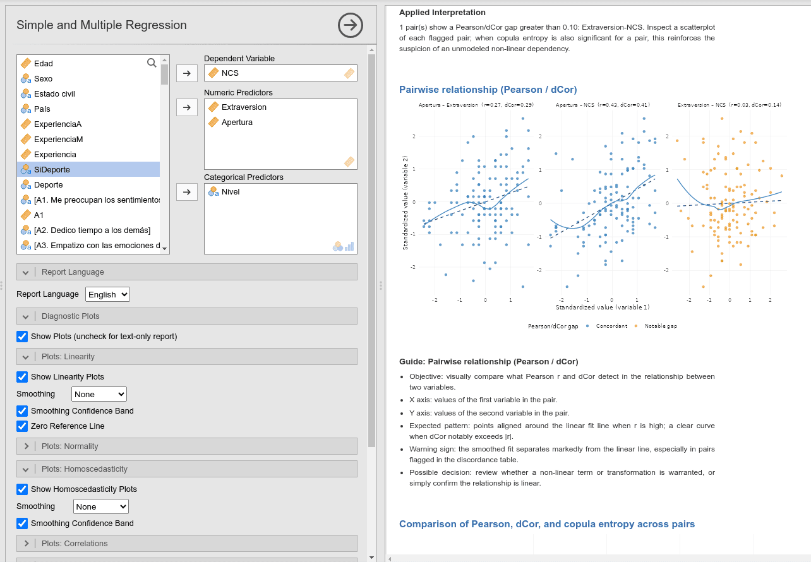
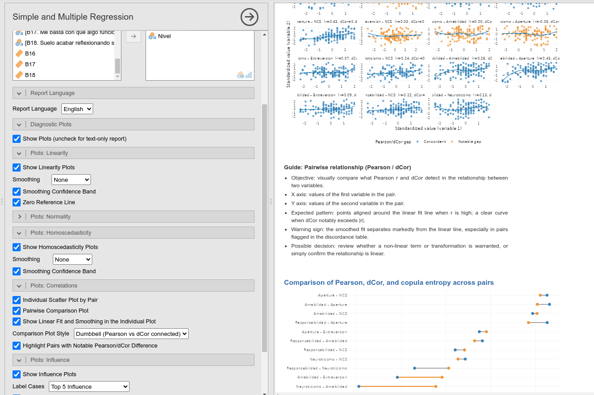
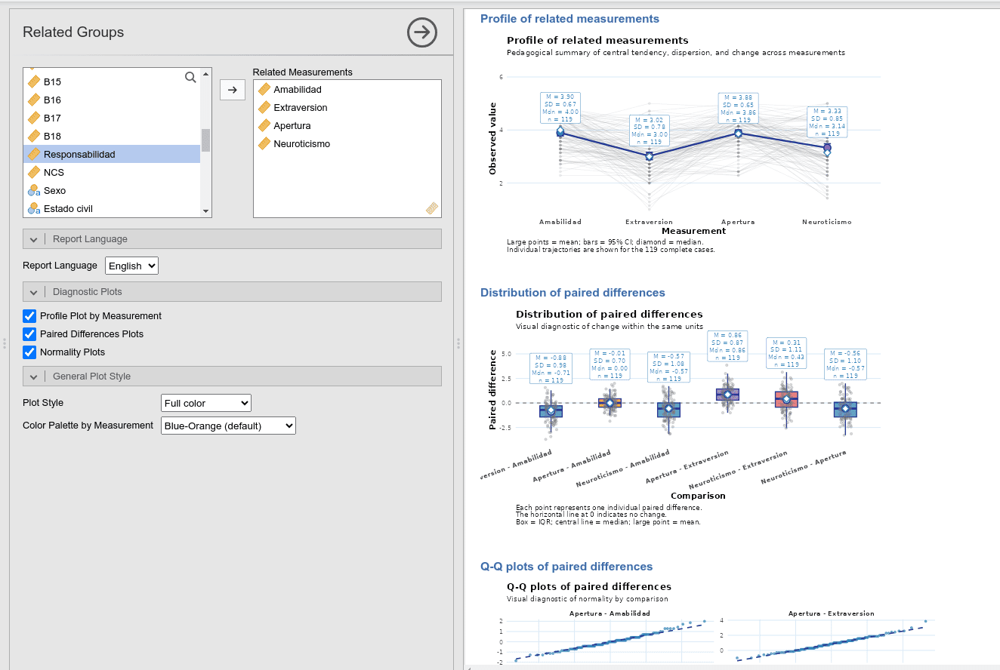
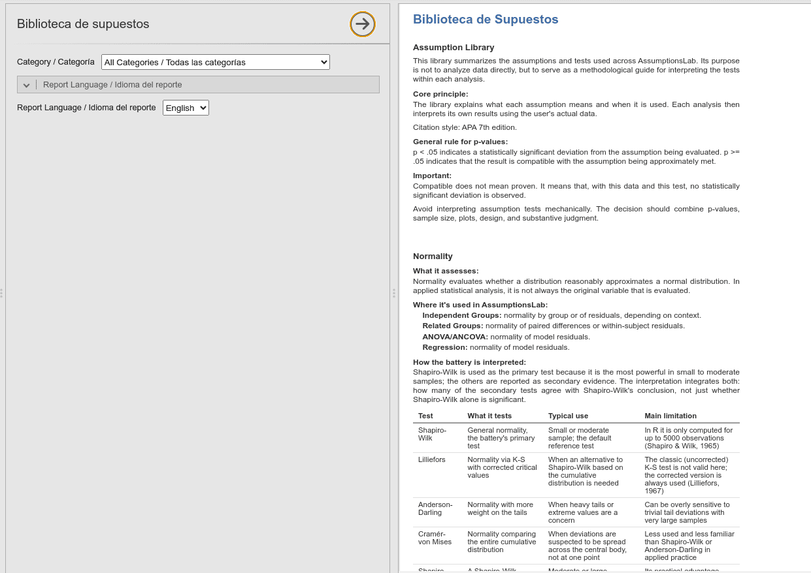
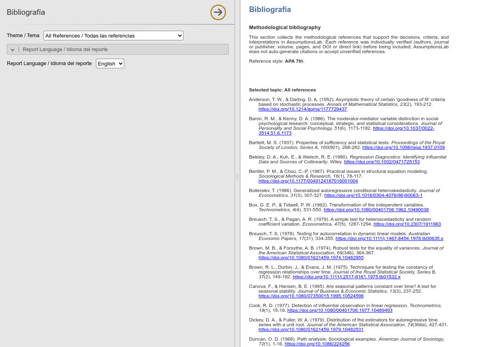

# AssumptionsLab

[](LICENSE)
[](https://github.com/ArchieJamDev/AssumptionsLab/releases)
[](https://github.com/ArchieJamDev/AssumptionsLab/actions/workflows/jamovi-check.yml)
[](https://doi.org/10.5281/zenodo.22209135)

> **A jamovi module for statistical assumptions assessment and evidence-based methodological decision support.**

AssumptionsLab is an open-source [jamovi](https://www.jamovi.org/) module built to help researchers, students, and practitioners evaluate the statistical assumptions required for common analytical techniques. Unlike conventional statistical software that simply computes diagnostic tests, AssumptionsLab pairs every diagnostic with methodological guidance, plain-language interpretation, and educational support — turning assumption-checking into a structured part of the research workflow rather than a checklist run once and forgotten.

## Contents

- [Why AssumptionsLab?](#why-assumptionslab)
- [Screenshots](#screenshots)
- [Modules](#modules)
- [Methodological Philosophy](#methodological-philosophy)
- [Installation](#installation)
- [For Developers](#for-developers)
- [Roadmap](#roadmap)
- [Contributing](#contributing)
- [Citation](#citation)
- [License & Author](#license--author)

---

## Why AssumptionsLab?

Statistical assumptions are frequently treated as a checklist performed immediately before running an analysis. But assumption assessment influences model selection, result validity, and interpretation throughout the whole research process — not just at the start.

AssumptionsLab bridges the gap between statistical computation and methodological reasoning by providing:

- Evidence-based methodological guidance alongside every diagnostic, not just the numbers.
- Plain-language interpretation of what a result means and what to do about it.
- A built-in methodological library and a unified, APA 7th-referenced bibliography, so a diagnostic can be traced back to its source literature without leaving jamovi.
- The same validation, diagnostic, and reporting workflow across every module, so learning one analysis transfers to the next.

Rather than asking users to memorize statistical rules, AssumptionsLab helps them understand **why an assumption matters and how violating it changes what the analysis can tell them**.

---

## Screenshots

<table width="100%">
  <tr>
    <td align="center" width="50%">
      
      <p><em>The full suite integrated into jamovi's own menu</em></p>
    </td>
    <td align="center" width="50%">
      
      <p><em>Path Analysis & Structural Validation</em></p>
    </td>
  </tr>
  <tr>
    <td align="center" width="50%">
      
      <p><em>Regression models and diagnostics</em></p>
    </td>
    <td align="center" width="50%">
      
      <p><em>Pearson vs. distance correlation / copula entropy</em></p>
    </td>
  </tr>
  <tr>
    <td align="center" width="50%">
      
      <p><em>Influence and scatter diagnostics</em></p>
    </td>
    <td align="center" width="50%">
      
      <p><em>Related Groups analysis</em></p>
    </td>
  </tr>
  <tr>
    <td align="center" width="50%">
      
      <p><em>The built-in Assumption Library</em></p>
    </td>
    <td align="center" width="50%">
      
      <p><em>Integrated, APA-referenced Bibliography</em></p>
    </td>
  </tr>
</table>

---

## Modules

| Module | What it checks |
|---|---|
| **Independent Groups** | Normality within each group, homogeneity of variance (Levene), outlier flagging — for the independent-samples t-test / Mann-Whitney U decision. |
| **Related Groups** | Normality of paired differences, sphericity (Mauchly) — for a paired t-test/Wilcoxon (2 measures) or repeated-measures ANOVA/Friedman (3+ measures). |
| **ANOVA/ANCOVA** | Residual normality, homogeneity of variance, homogeneity of regression slopes, covariate linearity, multicollinearity, case influence (Cook's D/leverage). |
| **Simple and Multiple Regression** | Linearity per predictor, homoscedasticity (Breusch-Pagan), residual normality, multicollinearity (VIF), case influence, Pearson correlation vs. distance correlation/copula entropy. |
| **Logistic Regression** | Linearity in the logit (Box-Tidwell), multicollinearity, calibration, discrimination (ROC/AUC), case influence. |
| **Ordinal Logistic Regression** | The proportional-odds assumption (Brant test), linearity in the cumulative logit, multicollinearity, case influence. |
| **Multinomial Logistic Regression** | Independence of Irrelevant Alternatives (Hausman-McFadden test), linearity per category, classification accuracy, multicollinearity, case influence. |
| **Path Analysis & Structural Validation** | An interactive path-diagram builder, residual normality/outliers, linear vs. non-linear association strength (distance correlation, copula entropy). |
| **Time Series** | Model-specific diagnostics for ARIMA, SARIMA, ETS, VAR, VECM, and GARCH — stationarity, residual autocorrelation, seasonality. |
| **Assumption Library** | A bilingual (EN/ES) glossary explaining every assumption and test above, filterable by category — a reference, not a computation. |
| **Bibliography** | A unified, APA 7th-only, topic-filtered bibliography of the verified methodological sources cited throughout the module. |

Every module (except the Library and Bibliography, which don't compute anything) reports both English and Spanish interpretations and shares the same validation → diagnostics → interpretation → recommendation workflow.

---

## Methodological Philosophy

AssumptionsLab is built around five principles:

1. Statistical software should support — not replace — methodological decision making.
2. Every recommendation should be grounded in scientific evidence.
3. Statistical results require meaningful interpretation, not just isolated numerical output.
4. Learning is an integral objective of the software, not an afterthought.
5. Methodological knowledge should be available exactly when it's needed — inside the analysis, not in a separate manual.

---

## Installation

AssumptionsLab is not yet in the official jamovi Library (submission in progress).

**From a pre-built module file (recommended for most users):**

1. Download the latest `.jmo` from [Releases](https://github.com/ArchieJamDev/AssumptionsLab/releases).
2. In jamovi Desktop, open the menu (⋮) → **Modules** → **Install from file** → select the downloaded `.jmo`.

**From source (for development):**

```bash
git clone https://github.com/ArchieJamDev/AssumptionsLab.git
cd AssumptionsLab
./compilar_modulo.sh
```

A bundled example dataset (documented column by column in [`data/README.md`](data/README.md)) ships with the module and shows up under **File → Open → Data Library → AssumptionsLab** in jamovi Desktop once installed.

---

## For Developers

Architecture, code conventions, and the full contributor workflow are documented separately so this README stays a project overview, not a manual:

- [`ARCHITECTURE.md`](ARCHITECTURE.md) — module structure and data flow.
- [`DEVELOPER_GUIDE.md`](DEVELOPER_GUIDE.md) — how to build a new analysis.
- [`CODE_STYLE.md`](CODE_STYLE.md) — the bilingual documentation and coding conventions every file follows.
- [`NEWS.md`](NEWS.md) — release history.

```bash
Rscript -e "jmvtools::prepare()"   # regenerate .h.R from the yaml files
Rscript -e "testthat::test_dir('tests/testthat')"   # run the edge-case test suite
```

---

## Roadmap

Planned future developments include:

- Structural Equation Modeling (SEM) and PLS-SEM
- Bayesian methods
- Multilevel models
- Survival analysis
- Meta-analysis

See [`ARCHITECTURE.md`](ARCHITECTURE.md#14-future-expansion) for the full list and design rationale.

---

## Contributing

Contributions are welcome. Please read [`CONTRIBUTING.md`](CONTRIBUTING.md) before submitting issues, feature requests, or pull requests.

---

## Citation

[](https://doi.org/10.5281/zenodo.22209135)

If you use AssumptionsLab in research, please cite the software using the information in [`CITATION.cff`](CITATION.cff), or via GitHub's "Cite this repository" button. The DOI above is the concept DOI — it always resolves to the latest release; cite a version-specific DOI instead only if you need to pin the exact version used in a specific analysis.

---

## License & Author

AssumptionsLab is licensed under the **GNU General Public License v3.0 (GPL-3.0)** — see [`LICENSE`](LICENSE).

**Arquímedes De León Chacón Chacón** — Psychologist · Data Scientist · Research Methodologist. Project Founder and Lead Developer. [ORCID](https://orcid.org/0000-0002-7014-7513)

Copyright © 2026 Arquímedes De León Chacón Chacón
